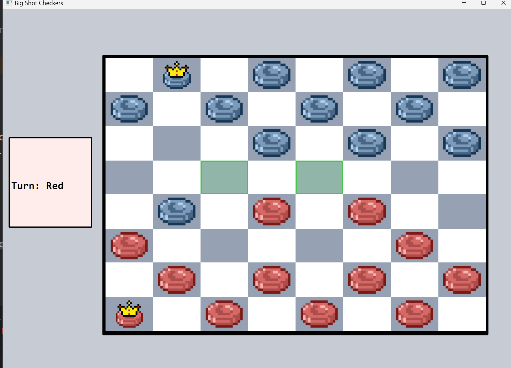
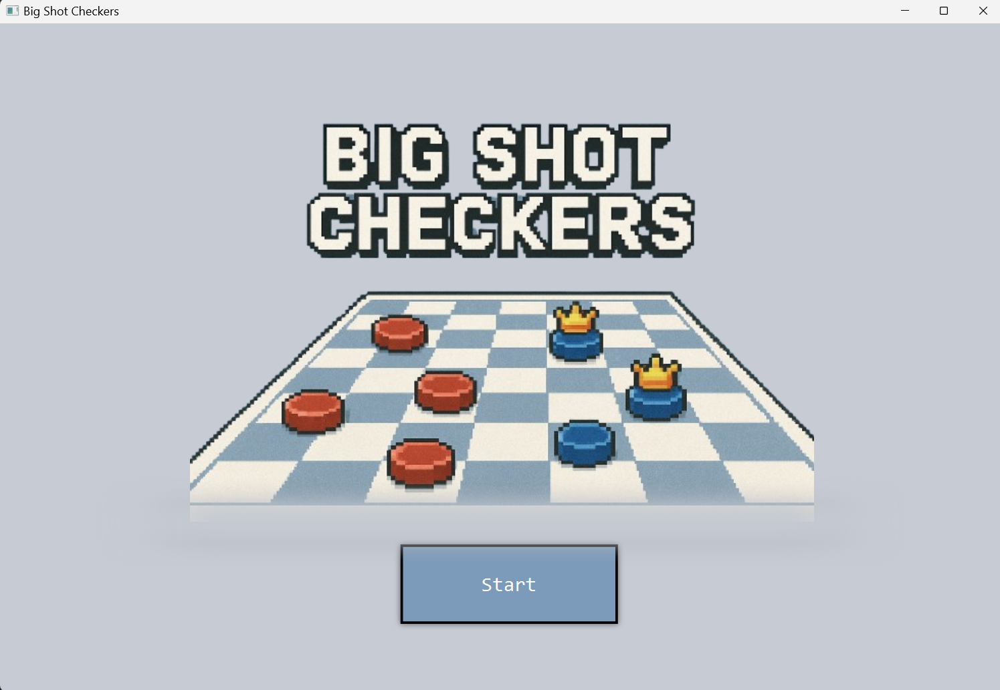
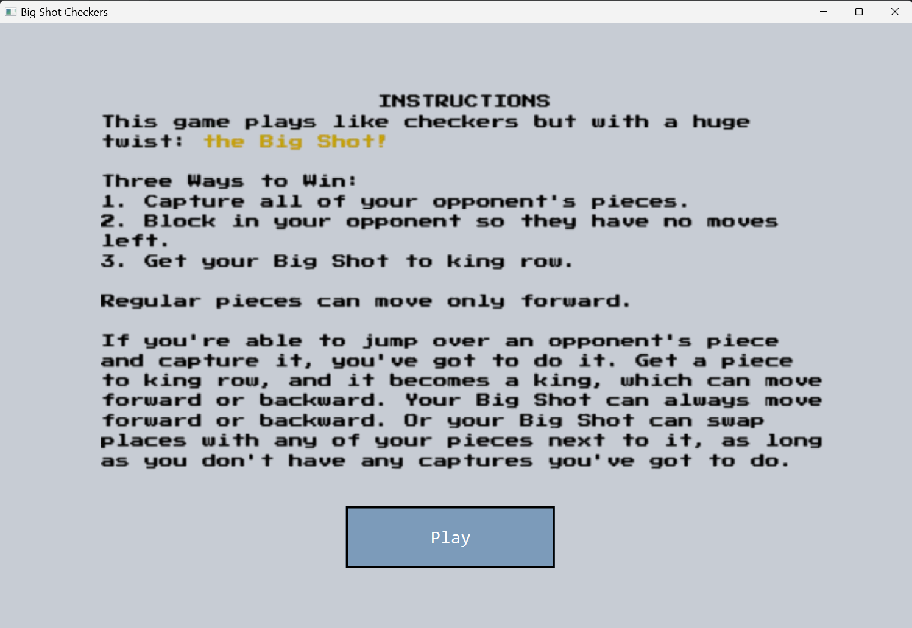
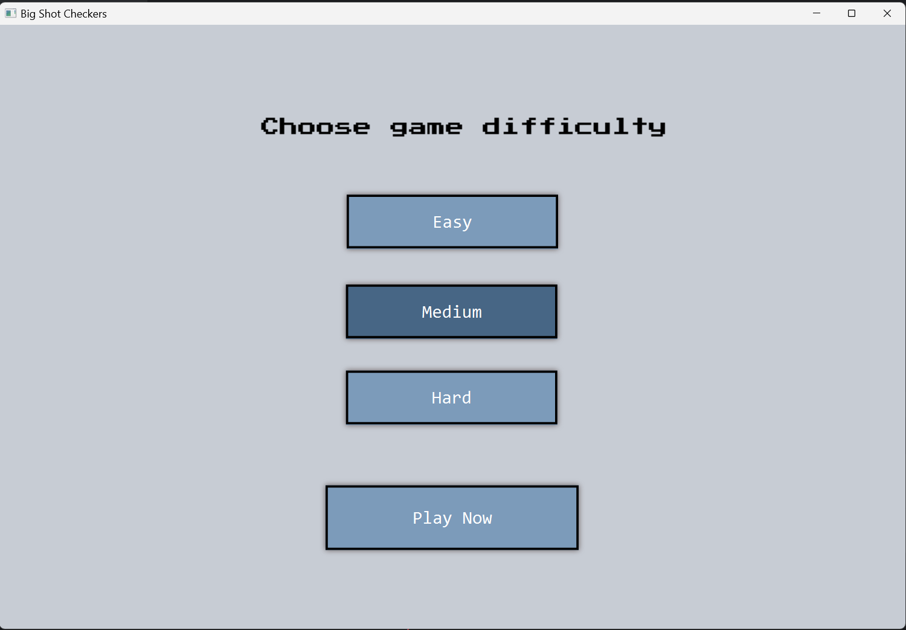
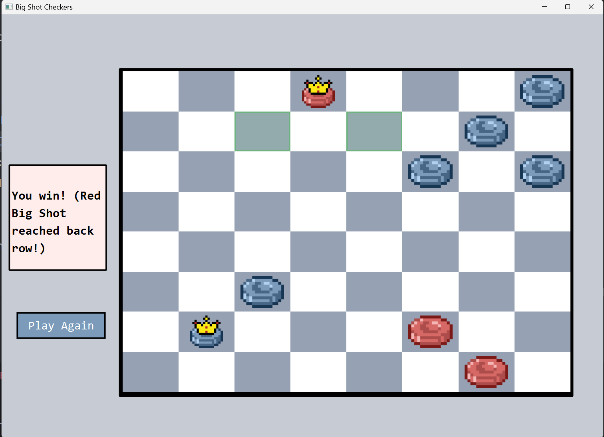

# AICheckers

**Checkers game with AI** — A JavaFX desktop game featuring an AI opponent built with Minimax + Alpha-Beta pruning, adjustable difficulty, and a simple clean UI.



---

## Overview
AICheckers is a **JavaFX-based checkers game** where you play against an AI opponent.  
The AI uses **Minimax with Alpha-Beta pruning** to evaluate and choose optimal moves at various difficulty levels.  
The game includes multiple FXML-based screens for the start menu, instructions, difficulty selection, and gameplay.

---

## Features
- AI opponent using **Minimax + Alpha-Beta pruning**
- Multiple **difficulty levels** (different AI search depths)
- “**Big Shot**” piece rule for instant win conditions
- Polished **JavaFX UI** with FXML, CSS, and image assets
- End-game detection and restart functionality

---

## Technologies
- **Java**, **JavaFX**, **FXML**, **CSS**
- **IntelliJ IDEA** for development and scene management

---

## How to Run
1. Clone the repository  
```bash
   git clone https://github.com/kirpiim/AICheckers.git
   cd AICheckers
```
2. Open the project in IntelliJ IDEA  
3. Configure the JavaFX SDK path
4. Run the main class (extends Application)

---

## Code Structure
- **controller/** — UI logic and scene transitions  
- **ai/** — Minimax + Alpha-Beta AI logic  
- **model/** — Board, Piece, and Move classes  
- **resources/** — FXML, CSS, and image assets  

---

## What I Learned
- Implementing AI using Minimax and Alpha-Beta pruning  
- Structuring a JavaFX app with FXML and MVC pattern  
- Managing multiple game scenes and difficulty logic  
- Debugging and testing AI decision-making  

---

## Screenshots

### Start Menu


### Instructins


### Difficulty Menu


### Victory Screen
